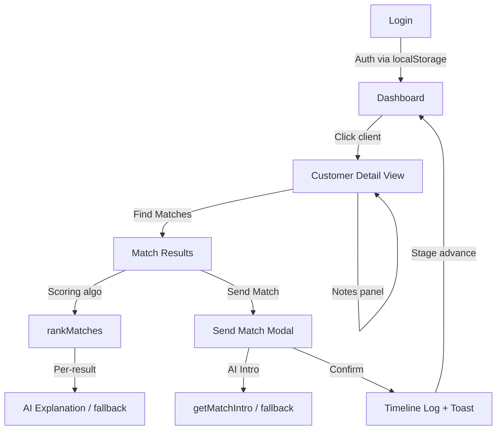

# TDC Matchmaker Dashboard

Internal matchmaker portal for The Date Crew. Lets matchmakers manage assigned clients, browse profiles, run AI-assisted matching, and send introduction emails.

---

## Quick Start

```bash
npm install
npm run dev
```

Open http://localhost:5173

**Demo credentials:**
| Email | Password | Clients |
|---|---|---|
| priya@tdc.com | tdc@2024 | Arjun Mehta, Kavya Iyer, Sneha Reddy |
| rahul@tdc.com | tdc@2024 | Vikram Singh, Rohan Kapoor |

---

## Architecture



**Key modules:**
- `src/lib/matchingEngine.ts` — weighted scoring, gender-specific logic, tier calculation
- `src/lib/aiService.ts` — AI proxy calls with deterministic fallbacks
- `src/context/CustomerContext.tsx` — notes + timeline persistence via localStorage
- `src/data/pool-profiles.json` — 120 seeded profiles (60F + 60M), generated by `scripts/generate-profiles.cjs`

---

## Tech Stack

- **React 19 + Vite 8 + TypeScript** — frontend framework
- **Tailwind CSS 4** via `@tailwindcss/vite` — utility-first styling
- **React Router 6** — client-side routing
- **lucide-react** — icons
- **localStorage** — session, notes, timeline persistence (no backend required for MVP)

---

## Matching Engine

### Gender-specific weights

**For Male customers** (candidate is Female):

| Criterion | Weight | Notes |
|---|---|---|
| Children Preference | 25% | Highest — core compatibility |
| Lifestyle (diet/drink/smoke) | 20% | Daily-life alignment |
| Religion | 15% | Shared values signal |
| Location / Relocation | 12% | Practical fit |
| Education Level | 10% | Comparable background |
| Age Compatibility | 8% | Younger-skew — **intentionally low** |
| Height | 5% | Shorter-preference — **intentionally low** |
| Income | 5% | Earns-less — **intentionally low, dated assumption** |

**For Female customers** (candidate is Male):

| Criterion | Weight | Notes |
|---|---|---|
| Children Preference | 22% | |
| Lifestyle | 18% | |
| Religion | 15% | |
| Location / Relocation | 15% | |
| Education / Profession | 15% | Same-level or complementary |
| Age Compatibility | 10% | Same-age to a few years older |
| Pets | 5% | |

### Tiers
- **High Potential** — score ≥ 75
- **Worth Exploring** — score 50–74
- **Long Shot** — score < 50

### Design note on age/height/income rules
The brief specified "younger, shorter, earns less" as signals for male clients. These reflect traditional conventions and are implemented with **intentionally low weights (5–8%)** so dated assumptions don't dominate ranking. Compatibility-first signals (kids, lifestyle, religion) carry 3–5× more weight. All weights are a tunable object in `matchingEngine.ts` — zero them out if not desired.

---

## AI Integration

Two AI use cases, both with deterministic fallbacks so the demo never breaks:

1. **Match Explanation** — After scoring, sends a compact breakdown to the LLM → 1–2 sentence plain-language explanation. Fallback builds it from top-scoring criteria.

2. **Personalized Intro Generator** — One-click warm intro paragraph for the match email. Editable before sending. Fallback constructs a structured intro from profile fields.

**API design:** calls hit `/api/ai` (server-side proxy) — the API key never touches client code. In this MVP the proxy falls back automatically. To enable real AI: deploy to Vercel with an `api/ai.ts` serverless function and set `ANTHROPIC_API_KEY` in environment variables.

---

## Data

- 5 hand-crafted customers across 2 matchmaker accounts (varied genders, stages, backgrounds)
- 120 pool profiles generated by `scripts/generate-profiles.cjs` with a fixed seed (mulberry32, seed=42) — fully reproducible
- Realistic Indian names, cities, colleges, companies, income bands

---

## Screens

| Screen | Path |
|---|---|
| Login | `/login` |
| Dashboard | `/dashboard` |
| Customer Detail | `/customers/:id` |
| Match Results | `/customers/:id/matches` |
| Pool Profiles | `/profiles` |
| Settings | `/settings` |

---

## Write-up

**Tech choices:** React + Vite + TypeScript for speed and type safety. Tailwind 4 for rapid consistent styling without a component library dependency. localStorage for zero-backend persistence — sufficient for a demo and keeps deployment trivially simple.

**Matching logic:** Two gender-specific weight configs feed a transparent scoring pipeline: hard filters first (opposite gender), then each criterion returns 0–1 multiplied by its weight, summed and normalized to 0–100. Every match exports a `breakdown` array so the UI and AI layer can both introspect *why* a score landed where it did. Tiers give matchmakers an instant scannable signal.

**AI integration:** The LLM receives a compact structured payload (profiles, scores, top criteria) and returns a 1–2 sentence explanation plus an editable intro paragraph. Both are optional — the product works fully offline via deterministic fallbacks. The intro is editable in the modal, giving matchmakers creative control.

**Assumptions:** (1) Age/height/income rules for male clients are low-weighted intentionally — see note above. (2) Religion/caste filters are soft signals, not hard blocks, unless a client explicitly marks religion as a must-match. (3) Pool of 120 profiles is seeded and static; production would query a database filtered to opposite-gender verified profiles.
